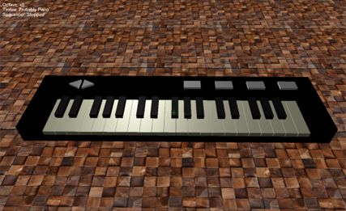
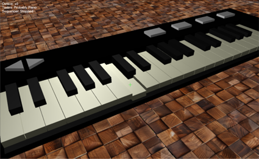
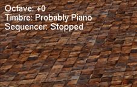
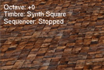
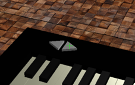
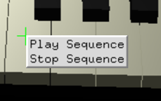
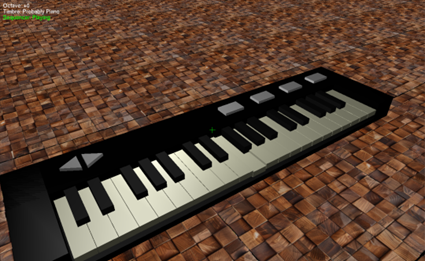

# 3D電子ピアノアプリケーション

   

**コンピュータグラフィックス作品**

3Dグラフィックスとリアルタイム音響合成技術を組み合わせた、インタラクティブな仮想電子ピアノアプリケーションです。マウス操作による手動演奏と、独自の楽譜ファイルを解釈する自動演奏機能を備えています。

> **学術情報**  
> この作品は、金沢工業大学情報工学科3年前期科目「コンピュータグラフィックス」の一環で制作されました。


*3D空間に配置された電子ピアノの全体画面*

## 🎹 主な特徴

### プロシージャルオーディオ
- **リアルタイム音響合成**: プログラムが音の波形を即座に計算・生成
- **加算合成による音色生成**: 複数のサイン波を合成して豊かな音色を表現
- **ADSRエンベロープ**: 自然な音の立ち上がりと減衰を実現
- **4種類の音色**: Piano、Synth Square、Synth Sawtooth、Vocal Sound

### 3Dグラフィックス
- **Blender製3Dモデル**: ピアノ本体、白鍵、黒鍵、操作ボタン
- **リアルタイムアニメーション**: 鍵盤の押下に連動したスムーズな動き
- **マルチライト**: メインライトとリムライトによる立体的な陰影
- **テクスチャマッピング**: 床面への木目調テクスチャ適用

### インタラクティブ操作
- **FPS風カメラ**: マウス+キーボードによる自由な視点移動
- **直感的な演奏**: レティクル照準による鍵盤選択とクリック演奏
- **音色・オクターブ変更**: ボタン操作で演奏設定をリアルタイム変更
- **自動演奏**: 右クリックメニューからシーケンス再生

### データ駆動型設計
- **独自音色フォーマット**: テキストファイルによる倍音構成定義
- **独自楽譜フォーマット**: 音名・音価記法による自動演奏データ
- **外部データ読み込み**: プログラム再コンパイル不要でコンテンツ変更可能

## 🚀 クイックスタート

### システム要件
- **OS**: Windows 10/11
- **開発環境**: Visual Studio 2019/2022
- **グラフィックス**: OpenGL対応GPU
- **オーディオ**: Windows Audio対応サウンドデバイス

### インストール・実行

詳細な環境構築手順は **[Visual Studio セットアップガイド](docs/VISUAL_STUDIO_SETUP.md)** をご参照ください。

**簡単な手順**:
1. `PianoApp.sln`をVisual Studioで開く
2. プラットフォームを`x64`に設定
3. `F5`キーで実行

### 基本操作

| 操作 | 説明 |
|------|------|
| **マウス移動** | カメラの向きを変更 |
| **W/A/S/D** | 前後左右移動 |
| **Q/E** | 上昇・下降 |
| **左クリック** | レティクル位置の鍵盤・ボタンを操作 |
| **右クリック** | 自動演奏メニューを表示 |
| **ESC** | アプリケーション終了 |

## 🎵 使い方

### 手動演奏
1. マウスでカメラを動かし、緑色のレティクル（十字線）を鍵盤に合わせる
2. 左クリックで音を鳴らす
3. 鍵盤が沈み込み、選択した音色で音が再生される


*鍵盤をクリックして演奏している様子*

### 音色変更
- ピアノ本体上部の4つのボタンをクリック
- 音色名が画面左上のHUDに表示される


*音色変更前の初期状態*


*音色変更後の状態（HUDに新しい音色名が表示）*

### オクターブ変更
- ピアノ左側の三角矢印ボタンで上下2オクターブまで変更可能
- 現在のオクターブシフトがHUDに表示される


*オクターブボタン*

### 自動演奏
1. 右クリックでメニューを開く
2. "Play Sequence"を選択
3. 「きらきら星」が自動演奏される
4. "Stop Sequence"で停止


*右クリックで表示される自動演奏メニュー*


*自動演奏中の画面（HUDに"Sequencer: Playing"と表示）*

## 📁 プロジェクト構造

```
PianoApp/
├── PianoApp.c              # メインプログラム
├── include/
│   └── miniaudio.h         # オーディオライブラリ
├── object/                 # 3Dモデルファイル
├── textures/               # テクスチャファイル  
├── timbres/                # 音色定義ファイル
├── gakufu/                 # 楽譜ファイル
└── x64/Debug/              # 実行ファイル出力先
```

詳細なファイル構造とデータフォーマット仕様は **[技術仕様書](docs/TECHNICAL_SPECIFICATION.md)** をご参照ください。

## 🛠️ カスタマイズ

### 音色の追加・編集
音色ファイル（`timbres/neiro*.txt`）を編集することで、新しい音色を作成できます。

### 楽譜の追加・編集
楽譜ファイル（`gakufu/*.txt`）を編集して、新しい自動演奏曲を追加できます。

カスタマイズの詳細な方法は **[技術仕様書 - ファイルフォーマット仕様](docs/TECHNICAL_SPECIFICATION.md#6-ファイルフォーマット仕様)** をご参照ください。

## 🔧 トラブルシューティング

### よくある問題

**❌ ビルドエラー: "OpenGLライブラリが見つからない"**
- NuGetパッケージの復元を確認
- プラットフォームがx64に設定されているか確認

**❌ 実行時エラー: "音声デバイスの初期化に失敗"**
- 他のオーディオアプリケーションを終了
- Windowsの音声設定を確認

詳細なトラブルシューティングは **[Visual Studio セットアップガイド](docs/VISUAL_STUDIO_SETUP.md#️-よくある問題と解決法)** をご参照ください。

## 🏗️ 技術概要

このアプリケーションは以下の技術要素を組み合わせて構築されています：

- **プロシージャルオーディオ**: リアルタイム音響合成による多彩な音色生成
- **3Dグラフィックス**: OpenGL/GLUTによる立体的なピアノ表現
- **データ駆動型設計**: 外部ファイルによる音色・楽譜のカスタマイズ
- **非同期処理**: 音声とグラフィックスの並行処理

詳細な技術仕様は **[技術仕様書](docs/TECHNICAL_SPECIFICATION.md)** をご参照ください。

## 📚 ドキュメント

- **[README.md](README.md)**: このファイル（概要・使い方）
- **[技術仕様書](docs/TECHNICAL_SPECIFICATION.md)**: 詳細な技術仕様・API仕様
- **[Visual Studio セットアップガイド](docs/VISUAL_STUDIO_SETUP.md)**: 開発環境構築手順

---

> **本作品について**  
> この3D電子ピアノアプリケーションは、Visual Studioでの実行を前提として開発されており、コンピュータグラフィックスの基礎技術（3D描画、アニメーション、リアルタイム処理）とデジタル音響処理技術を組み合わせた学習成果物です。
