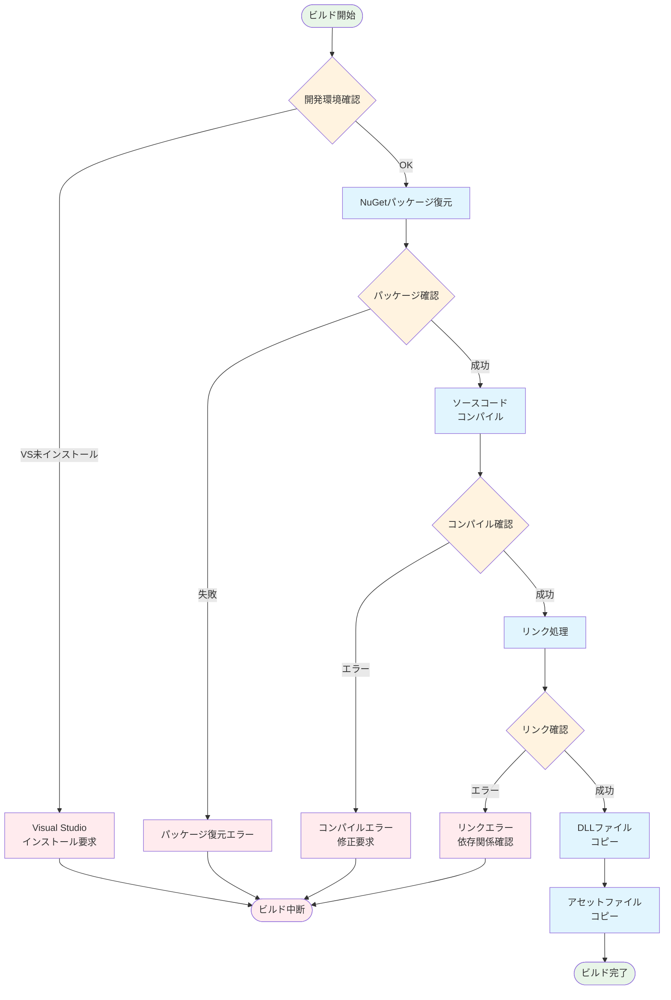

# 3D電子ピアノアプリケーション 技術仕様書

**バージョン**: 1.0  
**作成日**: 2025年8月26日  
**対象**: 開発者・技術評価者

## 目次

1. [システム概要](#1-システム概要)
2. [プロジェクト構造](#2-プロジェクト構造)
3. [アーキテクチャ設計](#3-アーキテクチャ設計)
4. [モジュール仕様](#4-モジュール仕様)
5. [データ構造仕様](#5-データ構造仕様)
6. [ファイルフォーマット仕様](#6-ファイルフォーマット仕様)
7. [API仕様](#7-api仕様)
8. [ビルド・デプロイ仕様](#8-ビルド・デプロイ仕様)
9. [パフォーマンス仕様](#9-パフォーマンス仕様)
10. [エラーハンドリング仕様](#10-エラーハンドリング仕様)

---

## 1. システム概要

### 1.1 システム目的
3Dグラフィックスとリアルタイム音響合成を組み合わせた教育用コンピュータグラフィックスアプリケーション。ユーザーがマウス操作で演奏可能な仮想電子ピアノと、独自楽譜形式による自動演奏機能を提供する。

### 1.2 技術スタック
| 分野 | 技術 | バージョン | 用途 |
|------|------|-----------|------|
| 言語 | C | C11 | メインプログラム |
| グラフィックス | OpenGL | 1.1+ | 3D描画・レンダリング |
| ウィンドウ管理 | GLUT | 3.0+ | ウィンドウ・イベント管理 |
| オーディオ | miniaudio | 0.11+ | リアルタイム音声処理 |
| 開発環境 | Visual Studio | 2019/2022 | ビルド・デバッグ |
| パッケージ管理 | NuGet | - | OpenGL依存関係管理 |

### 1.3 システム要件

#### 必須要件
- **OS**: Windows 10 (1903以降) / Windows 11
- **CPU**: Intel Core i3-6100 / AMD FX-6300 以上
- **メモリ**: 4GB RAM 以上
- **GPU**: DirectX 11対応 / OpenGL 2.1対応
- **ストレージ**: 100MB 空き容量
- **オーディオ**: Windows Audio対応デバイス

#### 推奨要件
- **CPU**: Intel Core i5-8400 / AMD Ryzen 5 2600 以上
- **メモリ**: 8GB RAM 以上
- **GPU**: 専用GPU（GeForce GTX 1050 / Radeon RX 560以上）
- **オーディオ**: 低レイテンシオーディオデバイス

---

## 2. プロジェクト構造

### ディレクトリ構成図


### 詳細ディレクトリ構造

```
PianoApp/
├── PianoApp.sln                          # Visual Studioソリューションファイル
├── README.md                             # プロジェクト概要・使用方法
│
├── packages/                             # NuGetパッケージ（OpenGL依存関係）
│   ├── nupengl.core.0.1.0.1/             # OpenGLコアライブラリ（ヘッダー・静的lib）
│   └── nupengl.core.redist.0.1.0.1/      # OpenGL再頒布ライブラリ（実行時DLL）
│
├── PianoApp/                             # メインプロジェクトディレクトリ
│   ├── PianoApp.c                        # メインソースコード（約2000行）
│   ├── PianoApp.vcxproj                  # Visual Studioプロジェクトファイル
│   ├── packages.config                   # NuGetパッケージ参照設定
│   │
│   ├── gakufu/                           # 楽譜データ
│   │   └── kirakira.txt                  # 「きらきら星」楽譜（独自フォーマット）
│   │
│   ├── include/                          # 外部ヘッダーファイル
│   │   └── miniaudio.h                   # 音響処理ライブラリ（ヘッダーオンリー）
│   │
│   ├── object/                           # 3Dモデルデータ（Blender製作）
│   │   ├── BlackKey.mtl/.obj             # 黒鍵モデル・マテリアル
│   │   ├── Body.mtl/.obj                 # ピアノ本体モデル・マテリアル
│   │   ├── Botton.mtl/.obj               # 音色ボタンモデル・マテリアル
│   │   ├── Botton2.mtl/.obj              # オクターブボタンモデル・マテリアル
│   │   ├── WhiteKey.mtl/.obj             # 白鍵モデル・マテリアル
│   │   └── Piano.blend                   # Blender原データファイル（OBJ作成用）
│   │
│   ├── textures/                         # テクスチャデータ
│   │   └── tile.ppm                      # 木目テクスチャ（PPM P6フォーマット）
│   │
│   └── timbres/                          # 音色定義ファイル
│       ├── neiro0.txt                    # Piano音色（基音+3倍音）
│       ├── neiro1.txt                    # Synth Square音色（基音+奇数倍音）
│       ├── neiro2.txt                    # Synth Sawtooth音色（基音+全倍音）
│       └── neiro3.txt                    # Vocal Sound音色（フォルマント強調）
│
├── x64/Debug/                            # ビルド出力（実行ファイル・ランタイムDLL）
│   ├── PianoApp.exe                      # 実行ファイル（約1.3MB）
│   ├── PianoApp.pdb                      # デバッグシンボル
│   ├── freeglut.dll                      # GLUTランタイム（NuGetから自動コピー）
│   └── glew32.dll                        # GLEWランタイム（NuGetから自動コピー）
│
└── docs/                                 # ドキュメント
    ├── TECHNICAL_SPECIFICATION.md        # 技術仕様書（本文書）
    ├── VISUAL_STUDIO_SETUP.md            # 開発環境セットアップガイド
    └── images/                           # ドキュメント用スクリーンショット
        ├── auto_play_active.png          # 自動演奏中画面
        ├── auto_play_menu.png            # 自動演奏メニュー画面
        ├── manual_play.png               # 手動演奏画面
        ├── octave_change.png             # オクターブ変更画面
        ├── piano_overview.png            # ピアノ全体画像
        ├── timbre_change_after.png       # 音色変更後画面
        └── timbre_change_before.png      # 音色変更前画面
```

---

## 3. アーキテクチャ設計

### 3.1 システム構成図


### 3.2 データフロー


---

## 4. モジュール仕様

### 4.1 main関数モジュール

#### 責務
- GLUTの初期化とウィンドウ作成
- コールバック関数の登録
- メインループの開始

#### インターフェース
```c
int main(int argc, char** argv)
```

#### 初期化シーケンス
1. `glutInit()` - GLUT初期化
2. `glutInitDisplayMode()` - 描画モード設定
3. `glutCreateWindow()` - ウィンドウ作成
4. `glutCreateMenu()` - 右クリックメニュー作成
5. `initialize_application()` - アプリケーション初期化
6. コールバック関数登録
7. `glutMainLoop()` - メインループ開始

#### 4.1.2 初期化シーケンス図


### 4.2 初期化・終了処理モジュール

#### 4.2.1 initialize_application()

**責務**: 全システムコンポーネントの初期化統括

**呼び出し順序**:
1. `initialize_opengl()` - OpenGL状態設定
2. `initialize_camera()` - カメラ初期位置設定
3. 3Dモデル読み込み (5種類)
4. テクスチャ読み込み
5. 音色ファイル読み込み (4種類)
6. 楽譜ファイル読み込み
7. `initialize_piano_keys()` - 鍵盤データ初期化
8. miniaudioデバイス初期化・開始

#### 4.2.2 initialize_opengl()

**設定項目**:
```c
glClearColor(0.6f, 0.8f, 1.0f, 1.0f);  // 背景色（空色）
glEnable(GL_DEPTH_TEST);                 // 深度テスト有効
glShadeModel(GL_SMOOTH);                 // スムーズシェーディング
glEnable(GL_LIGHTING);                   // ライティング有効
glEnable(GL_LIGHT0);                     // メインライト有効
```

**ライティング設定**:
- グローバル環境光: RGB(0.8, 0.8, 0.8)
- メインライト位置: (2.0, 10.0, 5.0)
- メインライト拡散反射: RGB(0.8, 0.8, 0.8)

#### 4.2.3 initialize_piano_keys()

**鍵盤配置アルゴリズム**:
```c
// 37鍵盤の配置決定ロジック
for (int i = 0; i < PIANO_KEY_COUNT; ++i) {
    int midi_note = i + MIDI_NOTE_START;  // 48 (C3) から開始
    int note_in_octave = (midi_note - 12) % 12;
    
    // 黒鍵判定: C#, D#, F#, G#, A#
    bool is_black = (note_in_octave == 1 || note_in_octave == 3 || 
                     note_in_octave == 6 || note_in_octave == 8 || 
                     note_in_octave == 10);
    
    if (is_black) {
        // 黒鍵: 事前定義配列から座標取得
        key->center_pos[0] = BLACK_KEY_X_POSITIONS[black_key_index++];
        key->center_pos[1] = 0.2f;
        key->center_pos[2] = 0.8f;
    } else {
        // 白鍵: 等間隔配置
        key->center_pos[0] = 7.0f - white_key_index++;
        key->center_pos[1] = 0.0f;
        key->center_pos[2] = 0.0f;
    }
}
```

### 4.3 データ読み込みモジュール

#### 4.3.1 load_obj_model()

**目的**: Wavefront OBJ形式の3Dモデル読み込み

**処理フロー**:
1. ファイル解析（2パス方式）
   - 1パス目: 頂点・法線・UV座標の総数カウント
   - 2パス目: 実際のデータ読み込み
2. メモリ確保
3. ディスプレイリスト生成
4. バウンディングボックス計算

**サポート形式**:
- 頂点: `v x y z`
- 法線: `vn x y z`
- UV座標: `vt u v`
- 面: `f v1/vt1/vn1 v2/vt2/vn2 v3/vt3/vn3`

**戻り値**:
```c
typedef struct {
    GLuint display_list_id;    // 描画用ディスプレイリスト
    bounding_box_t local_bbox; // 当たり判定用バウンディングボックス
} model_3d_t;
```

#### 4.3.2 load_ppm_texture()

**目的**: PPM P6形式画像のOpenGLテクスチャ変換

**サポート仕様**:
- フォーマット: PPM P6 (バイナリ)
- 最大色深度: 255
- カラーモード: RGB

**テクスチャ設定**:
```c
glTexParameteri(GL_TEXTURE_2D, GL_TEXTURE_WRAP_S, GL_REPEAT);
glTexParameteri(GL_TEXTURE_2D, GL_TEXTURE_WRAP_T, GL_REPEAT);
glTexParameteri(GL_TEXTURE_2D, GL_TEXTURE_MAG_FILTER, GL_NEAREST);
glTexParameteri(GL_TEXTURE_2D, GL_TEXTURE_MIN_FILTER, GL_NEAREST);
```

#### 4.3.3 load_timbre_file()

**目的**: 独自音色定義ファイルの解析

**ファイル構造**:
```
[行1] 音色名 (文字列)
[行2] 倍音数 (整数)
[行3以降] 振幅,位相シフト (浮動小数点ペア)
```

**エラーハンドリング**:
- ファイル読み込み失敗 → デフォルト音色 (純音) を適用
- 倍音数不正 → 処理中断・エラーログ出力
- 倍音データ不正 → 該当倍音を0振幅に設定

#### 4.3.4 load_sequence_file()

**目的**: 独自楽譜フォーマットのシーケンスデータ変換

**フォーマット仕様**:
```
[音名][変化記号][オクターブ][符点][音価]/
```

**パラメータ詳細**:
- 音名: C, D, E, F, G, A, B, M (休符)
- 変化記号: # (シャープ), b (フラット), 空白 (ナチュラル)
- オクターブ: 0-9
- 符点: . (符点あり), 空白 (符点なし)
- 音価: 2(全音符), 3(2分音符), 4(4分音符), 5(8分音符), 6(16分音符), 7(32分音符)

**MIDI変換式**:
```c
midi_note = 12 + (octave * 12) + base_note + accidental;
```

**音価時間計算**:
```c
float beat_duration_ms = (60.0f / tempo) * 1000.0f;  // 4分音符の長さ
float note_duration = base_duration * (dot ? 1.5f : 1.0f);  // 符点補正
```

### 4.4 描画処理モジュール

#### 4.4.1 display()

**描画順序**:
1. バッファクリア (`GL_COLOR_BUFFER_BIT | GL_DEPTH_BUFFER_BIT`)
2. 投影行列設定 (透視投影: FOV 45度)
3. ビュー行列設定 (`gluLookAt`)
4. ライト位置更新
5. 3Dオブジェクト描画
6. 2D UI描画 (オーバーレイ)
7. バッファスワップ (`glutSwapBuffers`)

#### 4.4.2 マテリアル定義

**白鍵マテリアル (象牙調)**:
```c
GLfloat MAT_IVORY_AMBIENT[]  = { 0.25f, 0.25f, 0.20f, 1.0f };
GLfloat MAT_IVORY_DIFFUSE[]  = { 0.9f, 0.9f, 0.8f, 1.0f };
GLfloat MAT_IVORY_SPECULAR[] = { 0.3f, 0.3f, 0.3f, 1.0f };
GLfloat MAT_IVORY_SHININESS  = 15.0f;
```

**黒鍵マテリアル (マット黒)**:
```c
GLfloat MAT_BLACK_MATTE_AMBIENT[]  = { 0.02f, 0.02f, 0.02f, 1.0f };
GLfloat MAT_BLACK_MATTE_DIFFUSE[]  = { 0.01f, 0.01f, 0.01f, 1.0f };
GLfloat MAT_BLACK_MATTE_SPECULAR[] = { 0.1f, 0.1f, 0.1f, 1.0f };
GLfloat MAT_BLACK_MATTE_SHININESS  = 5.0f;
```

#### 4.4.3 座標変換

**オブジェクト配置座標**:

| オブジェクト | 位置計算 | 備考 |
|-------------|----------|------|
| 白鍵 | `x = 7.0 - index`, `y = 0.0`, `z = 0.0` | 等間隔配置 |
| 黒鍵 | 事前定義配列参照 | 不等間隔配置 |
| ピアノ本体 | `(-3.5, -0.8, 1.5)` | 固定位置 |
| 音色ボタン | `x = {-5, -8, -11, -14}`, `y = 0.8`, `z = 3.5` | 4個配置 |
| オクターブボタン | `(6, 0.8, 3.5)`, `(5, 0.8, 3.5)` | 左右回転 |

### 4.5 入力・イベント処理モジュール

#### 4.5.1 on_mouse_button()

**ピッキング処理アルゴリズム**:
1. `get_world_pos_from_screen_center()` - 画面中央の3D座標取得
2. 各オブジェクトのワールド空間バウンディングボックス計算
3. 点-ボックス間当たり判定
4. 優先順位: 鍵盤 > 音色ボタン > オクターブボタン

**状態変更**:
- マウス押下: `trigger_note_on()` - 発音開始・鍵盤アニメーション
- マウス離上: `trigger_note_off()` - 全鍵盤発音停止

#### 4.5.2 on_keyboard_press()

**カメラ移動実装**:
```c
// 水平前方ベクトル正規化
float front_h_x = g_camera_front[0];
float front_h_z = g_camera_front[2];
float len = sqrt(front_h_x * front_h_x + front_h_z * front_h_z);
front_h_x /= len; front_h_z /= len;

// 右方向ベクトル計算（前方ベクトルとの垂直）
float right_h_x = -front_h_z;
float right_h_z = front_h_x;
```

**キーマッピング**:
| キー | 動作 | 移動方向 |
|------|------|----------|
| W | 前進 | +front_h |
| S | 後退 | -front_h |
| A | 左移動 | -right_h |
| D | 右移動 | +right_h |
| Q | 上昇 | +Y |
| E | 下降 | -Y |
| ESC | 終了 | `exit(0)` |

#### 4.5.3 on_mouse_move()

**マウスルック実装**:
```c
// ウィンドウ中央からのオフセット計算
float offset_x = (x - center_x) * MOUSE_SENSITIVITY;
float offset_y = (center_y - y) * MOUSE_SENSITIVITY;

// ヨー・ピッチ角度更新
g_camera_yaw += offset_x;
g_camera_pitch += offset_y;

// ピッチ制限 (-89度 ~ +89度)
g_camera_pitch = clamp(g_camera_pitch, -89.0f, 89.0f);

// 前方ベクトル再計算
g_camera_front[0] = cos(rad_yaw) * cos(rad_pitch);
g_camera_front[1] = sin(rad_pitch);
g_camera_front[2] = sin(rad_yaw) * cos(rad_pitch);
```

### 4.6 アニメーション・シーケンサーモジュール

#### 4.6.1 update_key_animation()

**鍵盤アニメーション補間**:
```c
for (int i = 0; i < PIANO_KEY_COUNT; ++i) {
    piano_key_t* key = &g_piano_keys[i];
    float diff = key->target_y_pos - key->current_y_pos;
    
    if (fabs(diff) > 0.001f) {
        // 線形補間による滑らかな移動
        key->current_y_pos += diff * KEY_ANIMATION_SPEED;
        needs_redisplay = 1;
    }
}
```

**タイマー設定**: 16ms間隔 (約60FPS)

#### 4.6.2 play_next_sequence_note()

**自動演奏ステートマシン**:
```c
if (!g_is_sequencer_playing) {
    // 停止状態: 全音符停止
    trigger_all_notes_off();
    return;
}

if (g_sequence_index >= g_sequence_length) {
    // 終了状態: シーケンサー停止
    g_is_sequencer_playing = 0;
    return;
}

// 再生状態: 次の音符処理
sequence_event_t* event = &g_sequence[g_sequence_index];
trigger_note_off(previous_midi_note);  // 前の音停止
trigger_note_on(event->midi_note);     // 新しい音開始

// 再帰タイマー設定
glutTimerFunc(event->duration_ms, play_next_sequence_note, event->midi_note);
```

### 4.7 オーディオ処理モジュール

#### 4.7.1 audio_callback()

**リアルタイム音声生成**:

**処理順序**:
1. 各鍵盤のエンベロープ状態更新
2. アクティブな鍵盤の波形計算
3. 加算合成によるミキシング
4. 振幅制限 (クリッピング防止)
5. ステレオ出力バッファ書き込み

**エンベロープ実装**:
```c
switch (key->envelope_state) {
case ENV_STATE_ATTACK:
    key->current_amplitude += attack_increment;
    if (key->current_amplitude >= 1.0) {
        key->envelope_state = ENV_STATE_PRESSED;
    }
    break;
    
case ENV_STATE_RELEASING:
    key->current_amplitude -= release_decrement;
    if (key->current_amplitude <= 0.0) {
        key->envelope_state = ENV_STATE_OFF;
    }
    break;
}
```

**加算合成計算**:
```c
for (int h = 0; h < timbre->harmonic_count; ++h) {
    harmonic_t* harmonic = &timbre->harmonics[h];
    double harmonic_freq = frequency * (h + 1);  // 基音の整数倍
    
    key_sample += harmonic->amplitude * 
                  sin(key->wave_phase * (h + 1) + harmonic->phase_shift);
}

mixed_sample += key->current_amplitude * key_sample;
```

#### 4.7.2 trigger_note_on() / trigger_note_off()

**発音開始処理**:
```c
void trigger_note_on(int midi_note) {
    piano_key_t* key = find_key_by_midi_note(midi_note);
    if (key) {
        key->envelope_state = ENV_STATE_ATTACK;
        key->current_amplitude = 0.0;
        key->wave_phase = 0.0;              // 位相リセット
        key->target_y_pos = KEY_PRESSED_Y_OFFSET;  // アニメーション開始
    }
}
```

**発音停止処理**:
```c
void trigger_note_off(int midi_note) {
    piano_key_t* key = find_key_by_midi_note(midi_note);
    if (key && (key->envelope_state == ENV_STATE_ATTACK || 
                key->envelope_state == ENV_STATE_PRESSED)) {
        key->envelope_state = ENV_STATE_RELEASING;  // リリース開始
        key->target_y_pos = 0.0f;                   // 鍵盤復帰
    }
}
```

---

## 5. データ構造仕様

### 5.1 core構造体

#### 5.1.1 piano_key_t
```c
typedef struct {
    key_type_e type;              // 鍵盤種類 (白鍵/黒鍵)
    int midi_note;                // MIDIノート番号 (48-84)
    float center_pos[3];          // 3D空間上の中心座標
    envelope_state_e envelope_state; // エンベロープ状態
    double wave_phase;            // 波形位相 (0-2π)
    double current_amplitude;     // 現在振幅 (0.0-1.0)
    float current_y_pos;          // アニメーション用Y座標
    float target_y_pos;           // アニメーション目標Y座標
} piano_key_t;
```

#### 5.1.2 データ構造関係図


#### 5.1.3 エンベロープ状態遷移図


#### 5.1.4 timbre_t
```c
typedef struct {
    char name[64];                // 音色名 (UI表示用)
    int harmonic_count;           // 倍音数
    harmonic_t* harmonics;        // 倍音配列 (動的確保)
} timbre_t;

typedef struct {
    float amplitude;              // 振幅 (0.0-1.0)
    float phase_shift;            // 位相シフト (ラジアン)
} harmonic_t;
```

#### 5.1.5 model_3d_t
```c
typedef struct {
    GLuint display_list_id;       // OpenGLディスプレイリスト ID
    bounding_box_t local_bbox;    // ローカル空間バウンディングボックス
} model_3d_t;

typedef struct {
    vector_3d_t min;              // 最小座標
    vector_3d_t max;              // 最大座標
} bounding_box_t;
```

#### 5.1.6 sequence_event_t
```c
typedef struct {
    int midi_note;                // MIDIノート番号 (0=休符)
    float duration_ms;            // 音価時間 (ミリ秒)
} sequence_event_t;
```

### 5.2 列挙型定義

#### 5.2.1 envelope_state_e
```c
typedef enum {
    ENV_STATE_OFF,        // 非発音状態
    ENV_STATE_ATTACK,     // アタック段階 (音量上昇中)
    ENV_STATE_PRESSED,    // サスティン段階 (音量維持中)
    ENV_STATE_RELEASING   // リリース段階 (音量減衰中)
} envelope_state_e;
```

#### 5.2.2 key_type_e

```c
typedef enum {
    KEY_TYPE_WHITE,       // 白鍵
    KEY_TYPE_BLACK        // 黒鍵
} key_type_e;
```

### 5.3 グローバル変数仕様

#### 5.3.1 3Dリソース
```c
model_3d_t g_model_piano_body;      // ピアノ本体モデル
model_3d_t g_model_white_key;       // 白鍵モデル
model_3d_t g_model_black_key;       // 黒鍵モデル
model_3d_t g_model_timbre_button;   // 音色ボタンモデル
model_3d_t g_model_octave_button;   // オクターブボタンモデル
GLuint g_texture_wood;              // 床テクスチャID
```

#### 5.3.2 オーディオ・ピアノ状態
```c
piano_key_t g_piano_keys[PIANO_KEY_COUNT];    // 37鍵盤データ配列
timbre_t g_timbres[TIMBRE_BUTTON_COUNT];      // 4音色データ配列
int g_current_timbre_index;                   // 選択中音色インデックス
int g_current_octave_shift;                   // オクターブシフト量
ma_device g_audio_device;                     // miniaudioデバイス
```

#### 4.3.3 カメラ状態
```c
float g_camera_pos[3];          // カメラ位置座標
float g_camera_front[3];        // カメラ前方ベクトル
float g_camera_up[3];           // カメラ上方ベクトル
float g_camera_yaw;             // ヨー角 (水平回転)
float g_camera_pitch;           // ピッチ角 (垂直回転)
```

#### 4.3.4 シーケンサー状態
```c
sequence_event_t* g_sequence;   // 楽譜データ配列 (動的確保)
int g_sequence_length;          // 楽譜イベント総数
int g_sequence_index;           // 現在再生位置
int g_is_sequencer_playing;     // 再生状態フラグ
```

---

## 6. ファイルフォーマット仕様

### 6.1 音色定義ファイル (.txt)

#### 6.1.1 フォーマット構造
```
[行1] 音色名文字列
[行2] 倍音数(整数)
[行3以降] 振幅,位相シフト (1行につき1倍音)
```

#### 6.1.2 サンプル (neiro0.txt)
```
Probably Piano
5
1.0,0.0
0.15,0.0
0.05,0.0
0.02,0.0
0.01,0.0
```

#### 6.1.3 パラメータ制約
- **音色名**: 最大63文字 (null終端含む)
- **倍音数**: 1以上の整数
- **振幅**: 0.0以上の浮動小数点数 (推奨: 0.0-1.0)
- **位相シフト**: ラジアン単位 (通常 0.0-2π)

#### 6.1.4 音響理論
基音周波数 f に対し、n番目の倍音は周波数 n×f で生成される:
```
音色波形 = Σ(amplitude[n] × sin(2πnt×f + phase_shift[n]))
```

### 6.2 楽譜定義ファイル (.txt)

#### 6.2.1 フォーマット構造
```
[音名][変化記号][オクターブ][符点][音価]/
```

#### 6.2.2 パラメータ詳細

**音名**:
- `C`, `D`, `E`, `F`, `G`, `A`, `B`: 音階
- `M`: 休符 (Mute)

**変化記号**:
- `#`: シャープ (+1半音)
- `b`: フラット (-1半音)
- ` `: ナチュラル (変化なし)

**オクターブ**:
- `0`-`9`: MIDI規格準拠 (C4 = 中央ド)

**符点**:
- `.`: 符点付き (音価×1.5倍)
- ` `: 符点なし

**音価**:
- `2`: 全音符 (4拍)
- `3`: 2分音符 (2拍)
- `4`: 4分音符 (1拍)
- `5`: 8分音符 (0.5拍)
- `6`: 16分音符 (0.25拍)
- `7`: 32分音符 (0.125拍)

#### 6.2.3 MIDI変換公式
```c
// 音名からベース値への変換
int base_notes[] = {0, 2, 4, 5, 7, 9, 11};  // C, D, E, F, G, A, B

// MIDI計算
midi_note = 12 + (octave * 12) + base_notes[note_index] + accidental;

// 時間計算 (BPM=120の場合)
beat_ms = (60.0 / 120.0) * 1000.0 = 500ms;  // 4分音符の長さ
duration_ms = beat_ms * note_duration_ratio * dot_multiplier;
```

#### 6.2.4 サンプル楽譜
```
C 4.4/    # 4分音符のC4 (中央ド)
D 4.5/    # 符点8分音符のD4
E 4.6/    # 符点16分音符のE4
F#4.4/    # 符点4分音符のF#4 (ファのシャープ)
M   4/    # 4分休符
```

#### 6.2.5 楽譜パース処理フロー


### 6.3 3Dモデルファイル (Wavefront OBJ)

#### 6.3.1 サポートディレクティブ
- `v x y z`: 頂点座標
- `vn x y z`: 法線ベクトル
- `vt u v`: テクスチャ座標
- `f v1/vt1/vn1 v2/vt2/vn2 v3/vt3/vn3`: 三角形面

#### 6.3.2 制約・注意事項
- **面形状**: 三角形のみサポート (四角形は非対応)
- **インデックス**: 1始まり (OBJ標準)
- **法線**: 各頂点に法線必須 (シェーディング用)
- **テクスチャ**: UV座標必須 (テクスチャマッピング用)

#### 6.3.3 モデル仕様

| ファイル | 用途 | 概算頂点数 | 備考 |
|----------|------|-----------|------|
| Body.obj | ピアノ本体 | ~500 | 複雑形状 |
| WhiteKey.obj | 白鍵 | ~50 | シンプル直方体 |
| BlackKey.obj | 黒鍵 | ~30 | 小型直方体 |
| Botton.obj | 音色ボタン | ~20 | 円筒形 |
| Botton2.obj | オクターブボタン | ~30 | 三角形ボタン |

### 6.4 テクスチャファイル (PPM P6)

#### 6.4.1 フォーマット構造
```
P6
# コメント行 (省略可)
width height
max_color_value
[バイナリRGBデータ]
```

#### 6.4.2 サポート仕様
- **フォーマット**: P6のみ (バイナリ)
- **色深度**: 255 (8bit/channel)
- **チャンネル**: RGB (3byte/pixel)
- **エンディアン**: ビッグエンディアン

---

## 7. API仕様

### 7.1 音響制御API

#### 7.1.1 midi_to_freq()
```c
float midi_to_freq(int midi_note);
```
**目的**: MIDIノート番号を周波数(Hz)に変換  
**計算式**: `f = 440 × 2^((midi_note - 69) / 12)`  
**パラメータ**: 
- `midi_note`: MIDIノート番号 (0-127, A4=69)  
**戻り値**: 周波数 (Hz)

#### 7.1.2 trigger_note_on()
```c
void trigger_note_on(int midi_note);
```
**目的**: 指定MIDIノートの発音開始  
**処理内容**:
- エンベロープ状態を`ENV_STATE_ATTACK`に設定
- 波形位相を0にリセット
- 鍵盤アニメーション開始

#### 7.1.3 trigger_note_off()
```c
void trigger_note_off(int midi_note);
```
**目的**: 指定MIDIノートの発音停止  
**処理内容**:
- エンベロープ状態を`ENV_STATE_RELEASING`に設定
- 鍵盤アニメーション復帰開始

### 7.2 3D制御API

#### 7.2.1 get_world_pos_from_screen_center()
```c
vector_3d_t get_world_pos_from_screen_center();
```
**目的**: 画面中央レティクルの3D空間座標取得  
**処理内容**:
1. 画面中央の深度バッファ値読み取り
2. `gluUnProject()`による逆変換
3. 3D座標算出

#### 7.2.2 is_point_in_box()
```c
int is_point_in_box(vector_3d_t point, bounding_box_t box);
```
**目的**: 点-直方体間当たり判定  
**戻り値**: 1=内部, 0=外部

### 7.3 データ管理API

#### 7.3.1 load_obj_model()
```c
model_3d_t load_obj_model(const char* filename);
```
**目的**: OBJファイル読み込み・OpenGL登録  
**戻り値**: `model_3d_t`構造体 (ディスプレイリストID + バウンディングボックス)

#### 7.3.2 load_timbre_file()
```c
void load_timbre_file(const char* filename, int timbre_index);
```
**目的**: 音色ファイル読み込み・倍音データ設定

#### 7.3.3 load_sequence_file()
```c
void load_sequence_file(const char* filename, float tempo);
```
**目的**: 楽譜ファイル読み込み・シーケンスデータ変換  
**パラメータ**:
- `filename`: 楽譜ファイルパス
- `tempo`: テンポ (BPM)

---

## 8. ビルド・デプロイ仕様

### 8.1 ビルド環境

#### 8.1.1 必要ソフトウェア
- **Visual Studio**: 2019 (16.0+) または 2022 (17.0+)
- **Windows SDK**: 10.0.19041.0以上
- **MSVC**: v142 (Visual Studio 2019) または v143 (Visual Studio 2022)
- **NuGet**: パッケージ管理 (Visual Studio内蔵)

#### 8.1.2 コンパイラ設定

**共通設定**:
```xml
<CharacterSet>Unicode</CharacterSet>
<ConformanceMode>true</ConformanceMode>
<WarningLevel>Level3</WarningLevel>
<SDLCheck>true</SDLCheck>
```

**Debug構成**:
```xml
<UseDebugLibraries>true</UseDebugLibraries>
<RuntimeLibrary>MultiThreadedDebugDLL</RuntimeLibrary>
<PreprocessorDefinitions>_DEBUG;_CONSOLE;%(PreprocessorDefinitions)</PreprocessorDefinitions>
```

**Release構成**:
```xml
<UseDebugLibraries>false</UseDebugLibraries>
<WholeProgramOptimization>true</WholeProgramOptimization>
<FunctionLevelLinking>true</FunctionLevelLinking>
<IntrinsicFunctions>true</IntrinsicFunctions>
<PreprocessorDefinitions>NDEBUG;_CONSOLE;%(PreprocessorDefinitions)</PreprocessorDefinitions>
```

### 8.2 依存関係管理

#### 8.2.1 NuGetパッケージ
```xml
<package id="nupengl.core" version="0.1.0.1" targetFramework="native" />
<package id="nupengl.core.redist" version="0.1.0.1" targetFramework="native" />
```

**提供ライブラリ**:
- **OpenGL**: `opengl32.lib`
- **GLUT**: `freeglut.lib`
- **GLEW**: `glew32.lib`
- **GLFW**: `glfw3dll.lib` (未使用)

#### 8.2.2 静的リンクライブラリ
- `freeglut.lib`: GLUTライブラリ
- `glew32.lib`: OpenGL Extension Wrangler
- `opengl32.lib`: Windows標準OpenGL

#### 8.2.3 動的リンクライブラリ (Runtime)
- `freeglut.dll`: GLUTランタイム
- `glew32.dll`: GLEWランタイム

### 8.3 ビルド手順

#### 8.3.1 コマンドライン
```batch
# Visual Studio環境設定
call "C:\Program Files\Microsoft Visual Studio\2022\Community\VC\Auxiliary\Build\vcvars64.bat"

# NuGetパッケージ復元
nuget restore PianoApp.sln

# ビルド実行
msbuild PianoApp.sln /p:Configuration=Release /p:Platform=x64
```

#### 8.3.2 ビルドプロセス図



#### 8.3.3 依存関係解決フロー


#### 8.3.4 Visual Studio GUI
1. `PianoApp.sln`を開く
2. プラットフォーム: `x64`選択
3. 構成: `Debug`または`Release`選択
4. メニュー: ビルド → ソリューションのリビルド

### 8.4 デプロイメント

#### 8.4.1 配布ファイル構成
```
PianoApp_Release/
├── PianoApp.exe        # 実行ファイル
├── freeglut.dll        # GLUTランタイム
├── glew32.dll          # GLEWランタイム
├── object/             # 3Dモデル
│   ├── Body.obj
│   ├── WhiteKey.obj
│   ├── BlackKey.obj
│   ├── Botton.obj
│   └── Botton2.obj
├── textures/           # テクスチャ
│   └── tile.ppm
├── timbres/            # 音色
│   ├── neiro0.txt
│   ├── neiro1.txt
│   ├── neiro2.txt
│   └── neiro3.txt
├── gakufu/             # 楽譜
│   └── kirakira.txt
└── README.md           # 使用説明書
```

#### 8.4.2 システム要件チェック
デプロイ前に以下を確認:
- Windows 10 (1903+) / Windows 11
- Visual C++ Redistributable 2019/2022
- DirectX 11対応GPU
- Windows Audio Service動作中

---

## 9. パフォーマンス仕様

### 9.1 フレームレート目標

#### 9.1.1 描画性能
- **目標FPS**: 60FPS (16.67ms/frame)
- **最低FPS**: 30FPS (33.33ms/frame)
- **VSync**: 有効 (画面ティアリング防止)

#### 9.1.2 レンダリング負荷
- **頂点数**: 約2,000-3,000 (全シーン)
- **ディスプレイリスト**: 5個 (モデル別)
- **テクスチャ**: 1枚 (512×512 RGB)
- **ライト**: 1個 (動的位置更新)

### 9.2 オーディオレイテンシ

#### 9.2.1 リアルタイム要件
- **目標レイテンシ**: <20ms (クリック-音出力)
- **サンプルレート**: 44.1kHz (CD品質)
- **ビット深度**: 32bit float (内部処理)
- **バッファサイズ**: 256-1024 samples (自動調整)

#### 9.2.2 音響処理負荷
- **同時発音数**: 最大37音 (全鍵盤)
- **倍音計算**: 各音最大10倍音
- **波形演算**: sin()関数 × 倍音数 × 発音数
- **更新頻度**: 44,100回/秒

### 9.3 メモリ使用量

#### 9.3.1 静的メモリ
- **グローバル変数**: ~50KB
- **3Dモデル**: ~500KB (5モデル合計)
- **テクスチャ**: ~768KB (512×512×3byte)
- **音色データ**: ~1KB (4音色合計)

#### 9.3.2 動的メモリ
- **楽譜データ**: ~10KB (最大1000音符)
- **音響バッファ**: ~20KB (miniaudio内部)
- **OpenGLバッファ**: GPU依存

#### 9.3.3 総メモリ使用量
- **RAM**: 約10-20MB (OS含まず)
- **VRAM**: 約5-10MB (解像度依存)

### 9.4 最適化手法

#### 9.4.1 描画最適化
- **ディスプレイリスト**: 静的ジオメトリの事前コンパイル
- **カリング**: バックフェース除去・深度テスト
- **LOD**: 距離に応じた詳細度調整 (未実装)

#### 9.4.2 音響最適化
- **非同期処理**: 音声生成を別スレッド化
- **循環バッファ**: メモリコピー削減
- **高速数学**: sin()のテーブル参照 (未実装)

#### 9.4.3 パフォーマンス監視図


---

## 10. エラーハンドリング仕様

### 10.1 エラー分類

#### 10.1.1 致命的エラー (Critical)
プログラム継続不可能、即座に終了

**原因例**:
- OpenGL初期化失敗
- 音声デバイス初期化失敗
- メモリ確保失敗 (メインバッファ)

**対処**:
```c
fprintf(stderr, "致命的エラー: %s\n", error_message);
cleanup_application();
exit(EXIT_FAILURE);
```

#### 10.1.2 警告エラー (Warning)
機能低下するが継続可能

**原因例**:
- 音色ファイル読み込み失敗
- 楽譜ファイル読み込み失敗
- テクスチャファイル読み込み失敗

**対処**:
```c
fprintf(stderr, "警告: %s デフォルト値を使用します。\n", error_message);
// デフォルト値設定
continue_execution();
```

#### 10.1.3 情報エラー (Info)
動作に影響しない通知

**原因例**:
- ファイル読み込み成功
- 設定値変更
- デバッグ情報

**対処**:
```c
printf("情報: %s\n", info_message);
```

### 10.2 具体的エラーハンドリング

#### 10.2.1 ファイル読み込みエラー

**3Dモデル読み込み失敗**:
```c
model_3d_t load_obj_model(const char* filename) {
    model_3d_t model = { 0 };  // 初期化
    FILE* file;
    
    if (fopen_s(&file, filename, "r") != 0 || file == NULL) {
        fprintf(stderr, "エラー: モデルファイル '%s' を開けません。\n", filename);
        return model;  // 無効モデル返却
    }
    
    // 正常処理...
}
```

**音色ファイル読み込み失敗**:
```c
void load_timbre_file(const char* filename, int timbre_index) {
    if (fopen_s(&file, filename, "r") != 0 || file == NULL) {
        fprintf(stderr, "警告: 音色ファイル '%s' を開けません。デフォルト音色を適用します。\n", filename);
        
        // デフォルト音色設定
        timbre->harmonic_count = 1;
        timbre->harmonics = malloc(sizeof(harmonic_t));
        timbre->harmonics[0] = (harmonic_t){ 1.0f, 0.0f };  // 純音
        sprintf_s(timbre->name, sizeof(timbre->name), "Default Sine");
        return;
    }
    
    // 正常処理...
}
```

#### 10.2.2 オーディオデバイスエラー

**デバイス初期化失敗**:
```c
if (ma_device_init(NULL, &device_config, &g_audio_device) != MA_SUCCESS) {
    fprintf(stderr, "エラー: 音声デバイスの初期化に失敗しました。\n");
    fprintf(stderr, "  - 他のアプリケーションがデバイスを使用していないか確認してください。\n");
    fprintf(stderr, "  - Windows音声設定を確認してください。\n");
    return;  // 音声なしで継続
}
```

**デバイス開始失敗**:
```c
if (ma_device_start(&g_audio_device) != MA_SUCCESS) {
    fprintf(stderr, "エラー: 音声デバイスの開始に失敗しました。\n");
    ma_device_uninit(&g_audio_device);
    return;  // 音声なしで継続
}
```

#### 10.2.3 メモリ確保エラー

**音色データ確保失敗**:
```c
timbre->harmonics = malloc(sizeof(harmonic_t) * timbre->harmonic_count);
if (timbre->harmonics == NULL) {
    fprintf(stderr, "エラー: 倍音データのメモリ確保に失敗しました。\n");
    fclose(file);
    return;  // 音色読み込み中断
}
```

**楽譜データ確保失敗**:
```c
g_sequence = malloc(sizeof(sequence_event_t) * g_sequence_length);
if (g_sequence == NULL) {
    fprintf(stderr, "エラー: シーケンスデータのメモリ確保に失敗しました。\n");
    fclose(file);
    g_sequence_length = 0;  // 自動演奏無効化
    return;
}
```

### 10.3 リソース管理

#### 10.3.1 cleanup_application()

**完全リソース解放**:
```c
void cleanup_application() {
    // オーディオデバイス停止・解放
    ma_device_uninit(&g_audio_device);
    
    // OpenGLリソース解放
    glDeleteLists(g_model_piano_body.display_list_id, 1);
    glDeleteLists(g_model_white_key.display_list_id, 1);
    glDeleteLists(g_model_black_key.display_list_id, 1);
    glDeleteLists(g_model_timbre_button.display_list_id, 1);
    glDeleteLists(g_model_octave_button.display_list_id, 1);
    glDeleteTextures(1, &g_texture_wood);
    
    // 動的メモリ解放
    for (int i = 0; i < TIMBRE_BUTTON_COUNT; ++i) {
        free(g_timbres[i].harmonics);
        g_timbres[i].harmonics = NULL;
    }
    
    free(g_sequence);
    g_sequence = NULL;
    
    printf("リソースを解放しました。\n");
}
```

#### 10.3.2 例外安全性

**RAII風パターン**:
```c
// 確保
FILE* file = NULL;
float* buffer = NULL;

// 処理
if (fopen_s(&file, filename, "r") != 0) goto cleanup;
buffer = malloc(size);
if (buffer == NULL) goto cleanup;

// 正常処理...

cleanup:
    if (file) fclose(file);
    if (buffer) free(buffer);
    return result;
```

### 10.4 デバッグ支援

#### 10.4.1 ログ出力

**情報レベル別出力**:
```c
// マクロ定義
#ifdef _DEBUG
    #define DEBUG_LOG(fmt, ...) printf("[DEBUG] " fmt "\n", __VA_ARGS__)
#else
    #define DEBUG_LOG(fmt, ...)
#endif

#define INFO_LOG(fmt, ...) printf("[INFO] " fmt "\n", __VA_ARGS__)
#define WARN_LOG(fmt, ...) fprintf(stderr, "[WARN] " fmt "\n", __VA_ARGS__)
#define ERROR_LOG(fmt, ...) fprintf(stderr, "[ERROR] " fmt "\n", __VA_ARGS__)
```

**使用例**:
```c
DEBUG_LOG("鍵盤%d: MIDI=%d, 状態=%d", key_index, midi_note, envelope_state);
INFO_LOG("音色 '%s' を読み込みました (倍音数: %d)", timbre_name, harmonic_count);
WARN_LOG("テクスチャファイル '%s' が見つかりません", texture_path);
ERROR_LOG("音声デバイスの初期化に失敗しました");
```

#### 10.4.2 エラー診断フローチャート


#### 10.4.3 システム状態監視


---

**技術仕様書 終了**

この技術仕様書は、3D電子ピアノアプリケーションの設計・実装・保守に必要な全ての技術的詳細を包括的に記述しています。Mermaid記法による視覚的な図表により、システム構造、データフロー、状態遷移、エラーハンドリングフローなどが直感的に理解できるよう設計されています。開発者、保守担当者、技術評価者が参照することで、システムの完全な理解と適切な運用が可能になります。
